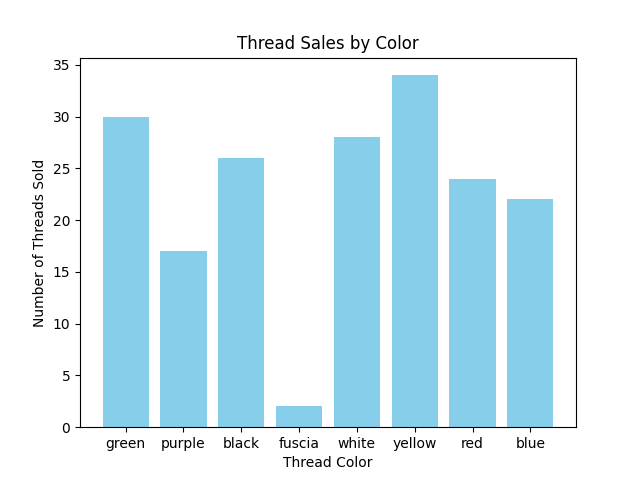

# Thread Shed Sales Analysis



## Project Overview

The **Thread Shed Sales Analysis** project focuses on parsing and analyzing sales data from a sewing supply store called "Thread Shed." The sales data is stored in a single, complex string, and we aim to transform it into meaningful insights by:

- Organizing the data into clean lists for customers, sales, and thread colors.
- Calculating the total sales for the day.
- Determining how many threads were sold for each color.

This is a project where we are utilizing Python to handle data parsing, cleaning, and visualization, showcasing how raw data can be processed into actionable insights.

---

## Key Tasks

1. **Data Parsing**: Break down the complex string into individual transactions, handling artifacts and separators effectively.
2. **Data Cleaning**: Trim unnecessary whitespace and ensure the data is in a uniform format.
3. **Data Organization**: Sort the cleaned data into separate lists for easier access and analysis (customers, sales amounts, and thread colors).
4. **Sales Calculation**: Compute the total revenue generated from all sales.
5. **Thread Color Analysis**: Count how many threads were sold for each color and identify trends.

---

## How to Use

### 1. **Prepare the Data**

- Save your sales data in a text file named `daily-sales.txt` with the following format:

  ```
  customer_name;color_1;color_2;color_3;...;sales_amount
  ...
  ```

- If a transaction involves multiple thread colors, use `;,;` as a separator. For example:

  ```
  John Doe;red;blue;,;;$15.00
  Jane Smith;green;,;;$10.00
  David Lee;white;black;,;;$20.00
  ```

### 2. **Run the Script**

- Execute the Python script to process the data and generate insights:
  ```bash
  python thread_sales_analysis.py
  ```

### 3. **View the Results**

- The script will:
  - Display the total sales amount for the day in the terminal.
  - Save a bar chart (`thread_sales.png`) that shows thread sales by color.

---

## Visualization

The generated **bar chart** will provide a clear and visually appealing breakdown of thread sales:

- **X-axis**: Thread colors.
- **Y-axis**: Number of threads sold.
- **Bars**: The height of each bar represents the sales volume of a particular thread color.

Ensure you have **matplotlib** installed to generate the chart. Install it using:

```bash
pip install matplotlib
```
